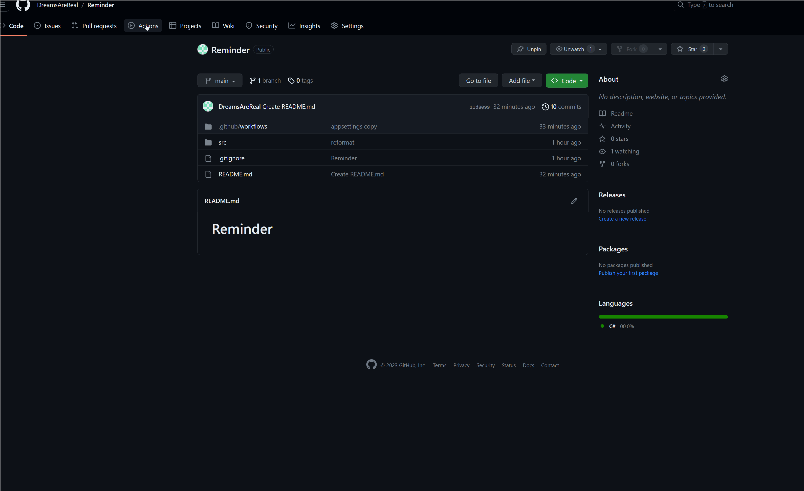

# 🌐 Overview

An application designed to send Telegram messages via cron, leveraging GitHub Actions for scheduled execution.

## 📝 Appsettings Configuration Guide
The `src\Reminder\appsettings.json` file is the configuration hub for the Reminder application, providing essential information for proper execution. Let's break down the fields and understand their roles:
### 📱 TelegramBotConfig
This section contains configuration details for the Telegram bot used to send notifications.
- Token: Replace `YOUR_TELEGRAM_TOKEN` with the actual token of your Telegram bot.
- ChatId: Replace `YOUR_CHAT_ID` with the chat ID where you want to receive notifications.
### 🗒️ ReminderConfig
This section holds general configuration settings for reminders.
- TimezoneName: Replace `YOUR_TIMEZONE` with the name of your desired timezone (e.g., "Europe/Moscow").
- Reminders: An array of specific reminder configurations.
### 📅 Reminder Configuration
Each reminder in the "Reminders" array has the following properties:
- Text: Replace `YOUR_REMINDER_TEXT` with the content of your reminder.
- ReminderIn: Set the date and time when the reminder should trigger in the format `YYYY-MM-DD`.
- ReminderType: Choose the type of reminder from the available options:
   - `OncePerYear`: Annually repeating reminder (compares day and month).
   - `OncePerMonth`: Monthly repeating reminder (compares the day).
   - `OnceTime`: One-time reminder (compares day, month and year).
# 🚀 Run Reminder GitHub Actions Workflow
1. Create a private repository.
2. Move the files for this project to your repository.
3. Update the file located along the path `.github\workflows\` with the name `dotnet.yml`

```yaml
on:
  workflow_dispatch:
  schedule:
    - cron: '0 4 * * *' # Required launch time in UTC
```

## You can also run the application yourself

# 💡Limits
As part of our free tier, you can enjoy up to 2000 minutes of GitHub Actions usage per month. Please note the following:
- The free tier includes 2000 minutes of GitHub Actions usage monthly.
- Any usage beyond this limit may result in additional charges.
## Enjoy the automated reminder notifications! 🎉


